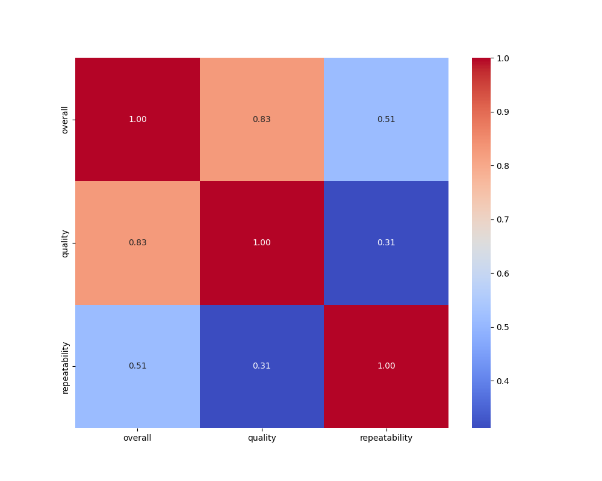

# Dataset Analysis Report

## Summary Statistics
|        | date      | language   | type   | title             | by                |    overall |     quality |   repeatability |
|:-------|:----------|:-----------|:-------|:------------------|:------------------|-----------:|------------:|----------------:|
| count  | 2553      | 2652       | 2652   | 2652              | 2390              | 2652       | 2652        |     2652        |
| unique | 2055      | 11         | 8      | 2312              | 1528              |  nan       |  nan        |      nan        |
| top    | 21-May-06 | English    | movie  | Kanda Naal Mudhal | Kiefer Sutherland |  nan       |  nan        |      nan        |
| freq   | 8         | 1306       | 2211   | 9                 | 48                |  nan       |  nan        |      nan        |
| mean   | nan       | nan        | nan    | nan               | nan               |    3.04751 |    3.20928  |        1.49472  |
| std    | nan       | nan        | nan    | nan               | nan               |    0.76218 |    0.796743 |        0.598289 |
| min    | nan       | nan        | nan    | nan               | nan               |    1       |    1        |        1        |
| 25%    | nan       | nan        | nan    | nan               | nan               |    3       |    3        |        1        |
| 50%    | nan       | nan        | nan    | nan               | nan               |    3       |    3        |        1        |
| 75%    | nan       | nan        | nan    | nan               | nan               |    3       |    4        |        2        |
| max    | nan       | nan        | nan    | nan               | nan               |    5       |    5        |        3        |

## Insights from LLM
Based on the provided dataset, several insights and patterns can be observed:

### 1. **Language Distribution**:
   - The dataset includes various languages: English, Tamil, Hindi, Telugu, and Malayalam.
   - English is the most prominent language with numerous entries, suggesting greater representation in the dataset.
   - Tamil and Telugu films follow, indicating a diverse representation of Indian cinema.

### 2. **Overall Ratings**:
   - The overall ratings spectrum ranges from a minimum of 1 to a maximum of 5.
   - The highest-rated films (5/5) are "Edge of Tomorrow" and "The Two Towers," illustrating exceptional reception.
   - Most films have ratings of 3, indicating a decent reception, while very few films scored below a 3.

### 3. **Quality Ratings**:
   - Quality ratings generally align with overall ratings, showing consistency between general audience reception and critical perception.
   - A notable consistency where several titles that scored 5 overall also received 4 or 5 in quality ratings, suggesting that high ratings correlate with the perception of quality.

### 4. **Type of Content**:
   - The dataset prominently features movies over TV series, which could indicate a sampling bias or focus on film content.
   - TV series entries such as "Designated Survivor" and "The Mentalist" show that while limited, there is interest in high-quality series.

### 5. **Recurrence of Actors/Directors**:
   - Notable actors such as Shah Rukh Khan appear multiple times, which may emphasize their popularity and marketability.
   - Similarly, actors like Ram (from Telugu cinema) have multiple entries, highlighting the common practice of starring in multiple successful films.

### 6. **Trends over Time**:
   - The dataset spans across multiple years, with entries from 2005 to 2023, indicating that newer films and series have generally received favorable ratings.
   - A noticeable gap in language spread after 2019 until 2023 suggests that more recent productions in the dataset often trend towards higher public and critical acclaim.

### 7. **Repeated Films**:
   - The dataset includes repetitive patterns with regard to film themes, such as action and drama, and suggests a tendency towards mainstream cinematic narratives.
   - Titles with multiple leads (e.g., ensemble casts) tend to get higher ratings, which could indicate that audience anticipation for star power increases perceived quality.

### 8. **Quality vs. Repeatability**:
   - Films with lower overall ratings often exhibit lower quality and repeatability scores, signaling a potential standard that connects repeat viewership to perceived quality.
   - Conversely, higher-rated films seem to sustain higher repeatability, indicating those films are more likely to be rewatched.

### Conclusion:
This dataset provides a wealth of insights into the relationships between film language, ratings, types, and trends over time. The consistent patterns suggest that higher quality is correlated with better overall reception, while certain actors repeatedly garner positive ratings, highlighting their importance in the industry. Further analysis could dig deeper into how these ratings impact future productions or audience engagement.

## Visualizations
### correlation_heatmap.png

### scatterplot.png

