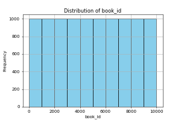
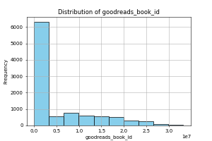

Based on the summary statistics and the information provided about the dataset, here are several insights and suggestions:

### Insights:

1. **Authors Distribution**:
   - The dataset has 10,000 entries, and there are 4,664 unique authors. This indicates a wide range of authors, but it would be interesting to see how many books are written by the most prolific authors.

2. **Publication Year**:
   - The original publication year ranges from before 1750 to 2017, with a mean year of approximately 1982. This suggests a strong representation of classic and modern titles, but further analysis on the trends over the decades (how many books were published per decade) could provide a clearer picture of the evolution of book publishing.

3. **Language Code**:
   - There are 25 unique language codes, with "eng" (English) being the most frequent. It may be useful to explore the distribution of books across different languages to understand the dataset's diversity.

4. **Ratings Analysis**:
   - The average rating is around 4.00, with a standard deviation of approximately 0.25. The ratings are somewhat skewed, as a large portion of ratings falls in the higher ranges. A histogram or boxplot of ratings might help visualize this distribution.

5. **Review Counts**:
   - The count of text reviews has significant variation, with the maximum being 155,254, likely suggesting popular works have a larger number of reviews. Exploring the correlation between the number of ratings/reviews and average ratings could yield interesting insights into reader engagement and quality perception.

6. **ISBN and Related Information**:
   - There are records of ISBN and ISBN13, but some entries might be missing or inconsistent. Cleaning this data could be vital for any analysis that depends on these identifiers.

### Suggestions:

1. **Correlation Analysis**:
   - Conduct a correlation analysis between various metrics, such as average rating and ratings count, to identify relationships that can inform marketing strategies or highlight trends.

2. **Trend Visualization**:
   - Create visualizations over time to show trends in average ratings or publication counts by year. This can help to visualize changing tastes in literature or the impact of certain authors on readers over time.

3. **Genre Analysis**:
   - If there is a category/genre column that was not mentioned, analyze how different genres perform in terms of ratings and total books published. This can provide insights into popular genres.

4. **Reader Sentiment**:
   - If there's qualitative data available from text reviews, performing sentiment analysis could give deeper insights into what readers appreciate or criticize about books.

5. **Popular Authors**:
   - Investigate the authors with the most published works and their average ratings. Additionally, see if there are any authors with high ratings but low book counts, which might indicate upcoming authors.

6. **Outlier Investigation**:
   - Explore any outliers in terms of publication years, ratings, or reviews. Some books may skew results significantly, and understanding why could provide valuable context and insights.

7. **Data Cleaning**:
   - Address any missing data in the ISBN fields and ensure there are no duplicates or inaccuracies within the dataset.

8. **Additional Visualizations**:
   - Produce additional visualizations like pie charts for genre distribution (if available), bar graphs for author publications, or heatmaps for ratings to better represent the data.

By following these suggestions, you can extract deeper and more actionable insights from this dataset, improving your overall understanding of the book landscape it represents.

## Visualizations

