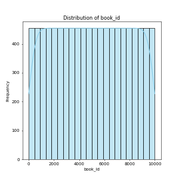
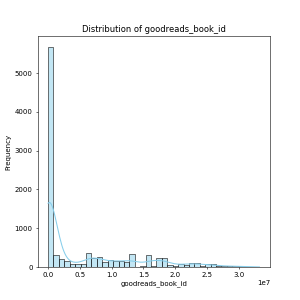
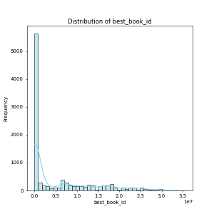

# Analysis Report

## Context from LLM

1. **Dataset Representation**: This dataset likely represents a collection of books with various attributes, such as identifiers (`book_id`, `goodreads_book_id`), publication details (`original_publication_year`, `original_title`, `title`, `authors`, `language_code`), and rating metrics (`average_rating`, `ratings_count`, detail on each rating level).

2. **Analyses to Perform**:
   - Descriptive statistics for numerical columns (mean, median, standard deviation).
   - Distribution analysis of ratings and publication years to identify trends.
   - Correlation analysis to understand relationships between ratings and other numerical variables.
   - Analysis of the most common authors or titles.
   - Missing value analysis for critical fields (e.g., `isbn`, `average_rating`).

3. **Useful Visualizations**:
   - Histograms of `average_rating` and `ratings_count` to see distributions.
   - Bar charts for the count of books by `original_publication_year` to identify publication trends over time.
   - Box plots for `average_rating` grouped by `language_code` or `authors` to compare ratings.
   - Scatter plots to explore relationships between `ratings_count` and `average_rating`.
   - Word clouds for `authors` or `title` to visualize common terms.

## Summary Statistics

```
                             count unique                                                top  ...              50%              75%              max
book_id                    10000.0    NaN                                                NaN  ...           5000.5          7500.25          10000.0
goodreads_book_id          10000.0    NaN                                                NaN  ...         394965.5       9382225.25       33288638.0
best_book_id               10000.0    NaN                                                NaN  ...         425123.5        9636112.5       35534230.0
work_id                    10000.0    NaN                                                NaN  ...        2719524.5      14517748.25       56399597.0
books_count                10000.0    NaN                                                NaN  ...             40.0             67.0           3455.0
isbn                          9300   9300                                          375700455  ...              NaN              NaN              NaN
isbn13                      9415.0    NaN                                                NaN  ...  9780451528640.0  9780830777175.0  9790007672390.0
authors                      10000   4664                                       Stephen King  ...              NaN              NaN              NaN
original_publication_year   9979.0    NaN                                                NaN  ...           2004.0           2011.0           2017.0
original_title                9415   9274                                                     ...              NaN              NaN              NaN
title                        10000   9964                                     Selected Poems  ...              NaN              NaN              NaN
language_code                 8916     25                                                eng  ...              NaN              NaN              NaN
average_rating             10000.0    NaN                                                NaN  ...             4.02             4.18             4.82
ratings_count              10000.0    NaN                                                NaN  ...          21155.5          41053.5        4780653.0
work_ratings_count         10000.0    NaN                                                NaN  ...          23832.5          45915.0        4942365.0
work_text_reviews_count    10000.0    NaN                                                NaN  ...           1402.0          2744.25         155254.0
ratings_1                  10000.0    NaN                                                NaN  ...            391.0            885.0         456191.0
ratings_2                  10000.0    NaN                                                NaN  ...           1163.0          2353.25         436802.0
ratings_3                  10000.0    NaN                                                NaN  ...           4894.0           9287.0         793319.0
ratings_4                  10000.0    NaN                                                NaN  ...           8269.5          16023.5        1481305.0
ratings_5                  10000.0    NaN                                                NaN  ...           8836.0          17304.5        3011543.0
image_url                    10000   6669  https://s.gr-assets.com/assets/nophoto/book/11...  ...              NaN              NaN              NaN
small_image_url              10000   6669  https://s.gr-assets.com/assets/nophoto/book/50...  ...              NaN              NaN              NaN

[23 rows x 11 columns]
```

## Visualizations







## Final Story from LLM

Based on the summary statistics you provided, we can extract several insights and suggestions for further analysis:

### Insights:

1. **High Number of Unique Authors**:
   - There are 4,664 unique authors among the 10,000 entries. This shows a diverse range of literature. You may want to analyze whether certain authors have disproportionately high ratings or a large number of books.

2. **Rating Distribution**:
   - The `average_rating` is approximately 4.00, which indicates a generally positive reception of the books in the dataset. However, with a `std` of 0.25, the ratings are quite clustered around the mean. Further segmentation of ratings (e.g., by genre or publication year) can provide deeper insights.

3. **Publication Year Range**:
   - The `original_publication_year` ranges from as early as 1750 to as late as 2017, suggesting a mix of classic and contemporary literature. Analyzing trends in ratings over time could indicate how literary preferences have shifted.

4. **High Number of Ratings**:
   - The high `ratings_count` (mean = 54,001) and `work_ratings_count` (mean = 59,687) suggest that many of these books are widely read. Correlating ratings with number of ratings could yield insights into the popularity vs. quality metric.

5. **Top Rating Frequencies**:
   - The highest frequency of ratings is for ratings of 5 (mean = 23,789). This suggests that many users are likely favorable towards this dataset. A closer inspection into what common attributes these highly rated books share could be beneficial.

6. **ISBN Discrepancies**:
   - The `isbn` and `isbn13` fields have a high number of unique entries, although with slightly fewer unique counts. This suggests that there are likely duplicates or missing values that may require cleaning.

### Suggestions for Further Analysis:

1. **Genre-Based Analysis**:
   - If a genre or category is available, consider analyzing average ratings and ratings counts by genre. This could lead to insights into which genres are most appreciated.

2. **Time-Series Analysis of Ratings**:
   - Given the diverse publication years, conducting a time-series analysis of average ratings could show trends in literary quality or popularity over time.

3. **Influence of Authors**:
   - Investigate if certain authors have significantly higher average ratings or ratings counts. Are there authors that consistently produce higher ratings?

4. **Rating Sentiment Analysis**:
   - If text data (like reviews) is available, performing sentiment analysis could complement the numerical ratings to provide qualitative insights.

5. **Handle Missing Values**:
   - Review the missing data noted in fields such as `isbn` and `original_title`. Analyze the impact of these missing values on your overall conclusions.

6. **Create a Correlation Matrix**:
   - Generate a correlation matrix to explore relationships between numerical features, such as `average_rating`, `ratings_count`, and `work_text_reviews_count`.

7. **Outlier Analysis**:
   - Examine the outliers in ratings counts and work ratings counts. These could represent exceptionally popular books or problematic data entries.

8. **Visualize Key Relationships**:
   - Use scatter plots or bar charts to visualize relationships between different measures like `ratings_count` vs. `average_rating`, or `original_publication_year` vs. `average_rating`.

By expanding your analysis to include these additional elements, you could uncover deeper insights and make your findings more robust and actionable.
