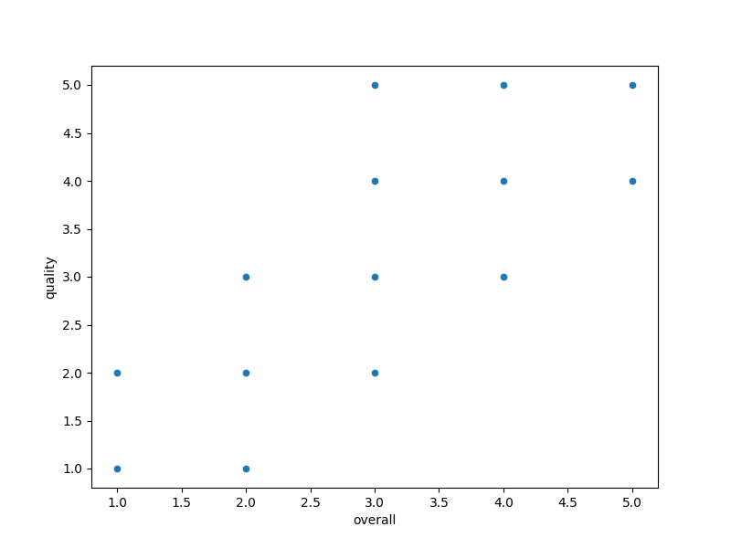

# Dataset Analysis Report

## Summary Statistics
|        | Country name   |       year |   Life Ladder |   Log GDP per capita |   Social support |   Healthy life expectancy at birth |   Freedom to make life choices |     Generosity |   Perceptions of corruption |   Positive affect |   Negative affect |
|:-------|:---------------|-----------:|--------------:|---------------------:|-----------------:|-----------------------------------:|-------------------------------:|---------------:|----------------------------:|------------------:|------------------:|
| count  | 2363           | 2363       |    2363       |           2335       |      2350        |                         2300       |                    2327        | 2282           |                 2238        |       2339        |      2347         |
| unique | 165            |  nan       |     nan       |            nan       |       nan        |                          nan       |                     nan        |  nan           |                  nan        |        nan        |       nan         |
| top    | Lebanon        |  nan       |     nan       |            nan       |       nan        |                          nan       |                     nan        |  nan           |                  nan        |        nan        |       nan         |
| freq   | 18             |  nan       |     nan       |            nan       |       nan        |                          nan       |                     nan        |  nan           |                  nan        |        nan        |       nan         |
| mean   | nan            | 2014.76    |       5.48357 |              9.39967 |         0.809369 |                           63.4018  |                       0.750282 |    9.77213e-05 |                    0.743971 |          0.651882 |         0.273151  |
| std    | nan            |    5.05944 |       1.12552 |              1.15207 |         0.121212 |                            6.84264 |                       0.139357 |    0.161388    |                    0.184865 |          0.10624  |         0.0871311 |
| min    | nan            | 2005       |       1.281   |              5.527   |         0.228    |                            6.72    |                       0.228    |   -0.34        |                    0.035    |          0.179    |         0.083     |
| 25%    | nan            | 2011       |       4.647   |              8.5065  |         0.744    |                           59.195   |                       0.661    |   -0.112       |                    0.687    |          0.572    |         0.209     |
| 50%    | nan            | 2015       |       5.449   |              9.503   |         0.8345   |                           65.1     |                       0.771    |   -0.022       |                    0.7985   |          0.663    |         0.262     |
| 75%    | nan            | 2019       |       6.3235  |             10.3925  |         0.904    |                           68.5525  |                       0.862    |    0.09375     |                    0.86775  |          0.737    |         0.326     |
| max    | nan            | 2023       |       8.019   |             11.676   |         0.987    |                           74.6     |                       0.985    |    0.7         |                    0.983    |          0.884    |         0.705     |

## Insights from LLM
Certainly! Here are some insights and observations from the provided dataset:

### General Observations:
1. **Life Ladder (Well-being Score)**:
   - Countries like **Iceland (7.476)** and **New Zealand (7.28)** exhibit higher life ladder scores, indicating better perceived well-being among their populations. In contrast, **Mali (3.975)** and **Bangladesh (3.408)** show notably lower scores.
   - There is a noticeable difference between high-income countries and low-income countries in terms of life ladder scores, with wealthier nations consistently reporting higher levels of well-being.

2. **Economic Indicators (Log GDP per capita)**:
   - Higher life ladder scores correlate with higher GDP per capita. For instance, **Iceland** and **Germany** possess high log GDP per capita (10.927 and 10.758 respectively), reflecting the economic prosperity associated with higher well-being.
   - Countries like **Niger (6.932)** and **Mali (7.591)**, despite their low life ladder scores, still have relatively lower GDP levels than the wealthier counterparts.

3. **Social Support**:
   - **Iceland (0.967)** and **New Zealand (0.958)** have high social support ratings, highlighting the importance of community and social networks in fostering individual well-being.
   - Many countries suffering from low life ladder scores, such as **Niger** and **Chad**, also report lower levels of social support, which may contribute to their overall dissatisfaction and lower psychological well-being.

4. **Health Indicators (Healthy Life Expectancy)**:
   - Countries with higher healthy life expectancy, such as **Iceland (71.95)** and **New Zealand (69.86)**, tend to have higher life ladder scores. In contrast, countries like **Congo (Brazzaville) (54.9)** exhibit lower life expectancy and life ladder scores.
   - This suggests a potential link between health outcomes and self-reported well-being.

5. **Freedom to Make Life Choices**:
   - Countries such as **Iceland (0.939)** and **Albania (0.824)** report significant freedoms regarding life choices, which could be influencing their higher life ladder scores.
   - Conversely, countries with lower indices, such as **Congo (Brazzaville) (0.85)** and **Tanzania (0.597)**, may face restrictions that could affect perceived well-being.

### Patterns and Correlations:
1. **Positive vs. Negative Affect**:
   - Positive affect scores tend to be higher in countries with higher life ladder scores, indicating that happier societies are more prevalent in wealthier nations.
   - Negative affect is less prevalent in high-ranked countries, further supporting the idea that economic prosperity and social welfare contribute to overall happiness.

2. **Generosity and Corruption**:
   - Countries exhibiting higher generosity scores often correspond with lower perceptions of corruption. For instance, **Iceland (0.24)** shows a commitment to generosity and a strong societal perception of integrity.
   - On the contrary, nations like **Bangladesh (0.865)** show a generous impulse, yet face high levels of corruption, which may create barriers to true societal well-being.

3. **Outliers**:
   - **Malaysia (2007)** reports a high life ladder score (6.239) with relatively lower GDP (9.867) compared to similarly ranked nations. This could indicate a unique social or cultural context affecting citizen well-being independently of economic factors.
   - The **State of Palestine** has varied scores across years, indicating significant instability or changes impacting social metrics.

### Conclusion:
The dataset reveals strong interdependencies between economic status, social factors, and perceived well-being across various countries. High life ladder scores generally correlate with robust economic, health, and social support indicators. Addressing societal inequalities, promoting health care access, and establishing systems for social support may enhance the well-being of populations, particularly in lower-income nations.

## Visualizations
### correlation_heatmap.png

### scatterplot.png

