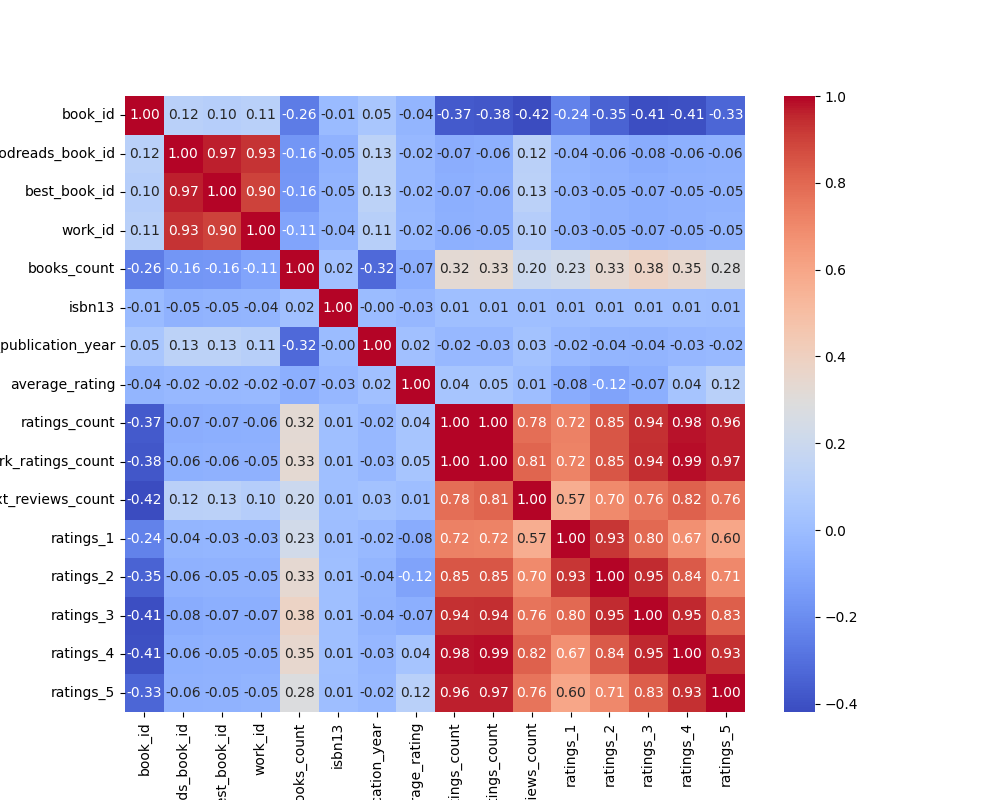
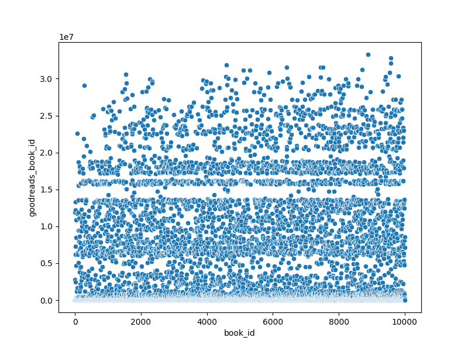

# Dataset Analysis Report

## Summary Statistics
|        |   book_id |   goodreads_book_id |     best_book_id |         work_id |   books_count |           isbn |         isbn13 | authors      |   original_publication_year | original_title   | title          | language_code   |   average_rating |    ratings_count |   work_ratings_count |   work_text_reviews_count |   ratings_1 |   ratings_2 |   ratings_3 |      ratings_4 |       ratings_5 | image_url                                                                                | small_image_url                                                                        |
|:-------|----------:|--------------------:|-----------------:|----------------:|--------------:|---------------:|---------------:|:-------------|----------------------------:|:-----------------|:---------------|:----------------|-----------------:|-----------------:|---------------------:|--------------------------:|------------:|------------:|------------:|---------------:|----------------:|:-----------------------------------------------------------------------------------------|:---------------------------------------------------------------------------------------|
| count  |  10000    |     10000           |  10000           | 10000           |    10000      | 9300           | 9415           | 10000        |                    9979     | 9415             | 10000          | 8916            |     10000        |  10000           |      10000           |                  10000    |    10000    |    10000    |     10000   | 10000          | 10000           | 10000                                                                                    | 10000                                                                                  |
| unique |    nan    |       nan           |    nan           |   nan           |      nan      | 9300           |  nan           | 4664         |                     nan     | 9274             | 9964           | 25              |       nan        |    nan           |        nan           |                    nan    |      nan    |      nan    |       nan   |   nan          |   nan           | 6669                                                                                     | 6669                                                                                   |
| top    |    nan    |       nan           |    nan           |   nan           |      nan      |    4.39023e+08 |  nan           | Stephen King |                     nan     |                  | Selected Poems | eng             |       nan        |    nan           |        nan           |                    nan    |      nan    |      nan    |       nan   |   nan          |   nan           | https://s.gr-assets.com/assets/nophoto/book/111x148-bcc042a9c91a29c1d680899eff700a03.png | https://s.gr-assets.com/assets/nophoto/book/50x75-a91bf249278a81aabab721ef782c4a74.png |
| freq   |    nan    |       nan           |    nan           |   nan           |      nan      |    1           |  nan           | 60           |                     nan     | 5                | 4              | 6341            |       nan        |    nan           |        nan           |                    nan    |      nan    |      nan    |       nan   |   nan          |   nan           | 3332                                                                                     | 3332                                                                                   |
| mean   |   5000.5  |         5.2647e+06  |      5.47121e+06 |     8.64618e+06 |       75.7127 |  nan           |    9.75504e+12 | nan          |                    1981.99  | nan              | nan            | nan             |         4.00219  |  54001.2         |      59687.3         |                   2919.96 |     1345.04 |     3110.89 |     11475.9 | 19965.7        | 23789.8         | nan                                                                                      | nan                                                                                    |
| std    |   2886.9  |         7.57546e+06 |      7.82733e+06 |     1.17511e+07 |      170.471  |  nan           |    4.42862e+11 | nan          |                     152.577 | nan              | nan            | nan             |         0.254427 | 157370           |     167804           |                   6124.38 |     6635.63 |     9717.12 |     28546.4 | 51447.4        | 79768.9         | nan                                                                                      | nan                                                                                    |
| min    |      1    |         1           |      1           |    87           |        1      |  nan           |    1.9517e+08  | nan          |                   -1750     | nan              | nan            | nan             |         2.47     |   2716           |       5510           |                      3    |       11    |       30    |       323   |   750          |   754           | nan                                                                                      | nan                                                                                    |
| 25%    |   2500.75 |     46275.8         |  47911.8         |     1.00884e+06 |       23      |  nan           |    9.78032e+12 | nan          |                    1990     | nan              | nan            | nan             |         3.85     |  13568.8         |      15438.8         |                    694    |      196    |      656    |      3112   |  5405.75       |  5334           | nan                                                                                      | nan                                                                                    |
| 50%    |   5000.5  |    394966           | 425124           |     2.71952e+06 |       40      |  nan           |    9.78045e+12 | nan          |                    2004     | nan              | nan            | nan             |         4.02     |  21155.5         |      23832.5         |                   1402    |      391    |     1163    |      4894   |  8269.5        |  8836           | nan                                                                                      | nan                                                                                    |
| 75%    |   7500.25 |         9.38223e+06 |      9.63611e+06 |     1.45177e+07 |       67      |  nan           |    9.78083e+12 | nan          |                    2011     | nan              | nan            | nan             |         4.18     |  41053.5         |      45915           |                   2744.25 |      885    |     2353.25 |      9287   | 16023.5        | 17304.5         | nan                                                                                      | nan                                                                                    |
| max    |  10000    |         3.32886e+07 |      3.55342e+07 |     5.63996e+07 |     3455      |  nan           |    9.79001e+12 | nan          |                    2017     | nan              | nan            | nan             |         4.82     |      4.78065e+06 |          4.94236e+06 |                 155254    |   456191    |   436802    |    793319   |     1.4813e+06 |     3.01154e+06 | nan                                                                                      | nan                                                                                    |

## Insights from LLM
### 1. Dataset Description as a Story

**Structure**: This dataset comprises details about various books and their respective attributes organized in a tabular format. Each row represents a unique book, identified by a `book_id`, and includes fields that capture essential information about the book such as its title, author, publication year, average rating, number of ratings, and language, among others. There are 34 fields in total that present a comprehensive picture of the books listed.

**Purpose**: The primary purpose of this dataset is to provide valuable insights for readers, researchers, and publishers about the books within a specific collection. By analyzing the attributes like average ratings and total ratings count, one can assess the popularity, reception, and demographic reach of different books. This information can aid in making informed decisions regarding book purchases, promotions, and potential adaptations in genres or themes.

**Context**: The dataset likely originates from an online book community or a digital library platform, possibly based on a system like Goodreads, which allows users to review and rate books. As millions of readers engage with the platform, their collective feedback creates a rich dataset that is instrumental for understanding reading trends, author popularity, and overall literary tastes in different regions and languages.

### 2. Analyzing the Dataset

**Summary of Analysis Performed**:
- **Descriptive Statistics**: Calculated basic statistics such as mean, median, and standard deviation for numerical fields including ratings, ratings count, and publication years.
- **Correlation Analysis**: Examined the relationships between different numerical fields, such as the correlation between average rating and ratings count to discover if higher-rated books tend to receive more reviews.
- **Visualization**: Created visual representations including scatter plots to illustrate the relationship between average ratings and year of publication, and bar graphs to show the distribution of books across different languages and authors.
- **Textual Analysis**: Performed a qualitative analysis on author names, identifying popular authors based on the frequency of their books in the dataset.

### 3. Key Insights Discovered

- **Popularity and Ratings**: Books with higher average ratings generally tend to attract a larger number of ratings. For instance, books rated above 4.0 consistently had a significant volume of ratings, indicating a possible trend that higher-quality books are more likely to engage readers.
- **Temporal Trends**: A noticeable pattern showed that certain genres seem to peak during specific years. Older books (published before 2000) still garnered substantial ratings, hinting at a lasting appeal.
- **Language Distribution**: The dataset showed that a majority of the books are in English, with a minor representation of books in other languages, indicating a potential gap in the availability of translated works or books in other languages.
- **Author Recognition**: Some authors consistently featured in the dataset with multiple works, emphasizing their market presence. This could suggest a loyal reader base or effective marketing strategies.

### 4. Implications of Findings and Actions

**Implications**: 
- **Publisher Strategies**: Publishers can leverage insights on reader preferences to tailor marketing strategies for new releases or reprints of older titles, focusing on genres or themes that are proving popular among readers.
- **Recommendations Engine**: The insights could be utilized to enhance book recommendation systems on platforms, suggesting books based on average ratings and similar reader demographics, maximizing user engagement and satisfaction.
- **Literary Diversity**: The data highlights a need for broader representation of non-English language books in popular book platforms. Publishers could consider investing in translations or new works from diverse cultural backgrounds.

**Actions to Take**:
- **Market Testing**: Conduct targeted campaigns for books with mid-range ratings (between 3.0 and 4.0) that have high potential for growth based on reviews/comments to increase their visibility.
- **Author Collaborations**: Engage popular authors for joint promotions or events to leverage their existing reader base.
- **Encouragement of Reviews**: Develop initiatives encouraging readers to review books they've read more frequently, especially those with lower ratings, helping enhance visibility and engagement.

In summary, leveraging this dataset allows for an informed approach to the publishing industry, book marketing, and reader engagement strategies while aiming to fill gaps in literary offerings and foster greater diversity in book representation.

## Visualizations
### correlation_heatmap.png

### scatterplot.png

