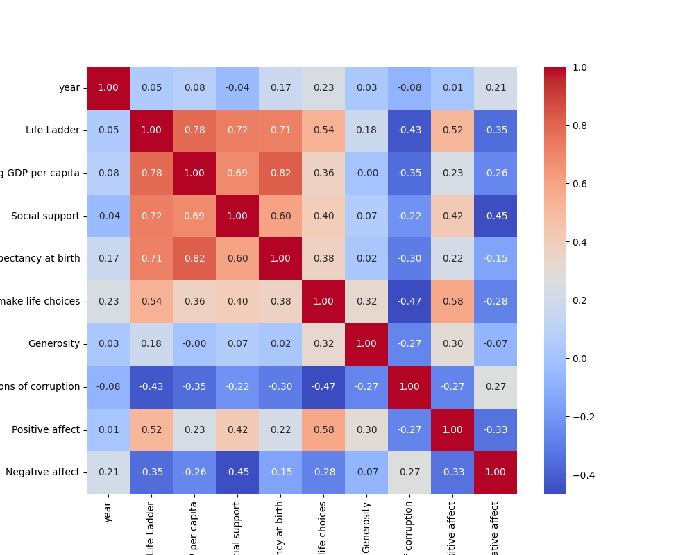
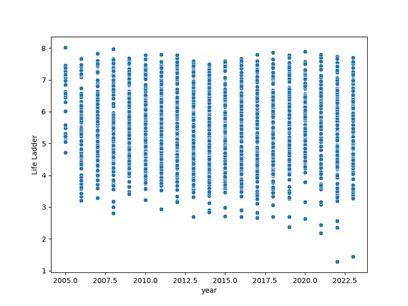

# Dataset Analysis Report

## Summary Statistics
|        | Country name   |       year |   Life Ladder |   Log GDP per capita |   Social support |   Healthy life expectancy at birth |   Freedom to make life choices |     Generosity |   Perceptions of corruption |   Positive affect |   Negative affect |
|:-------|:---------------|-----------:|--------------:|---------------------:|-----------------:|-----------------------------------:|-------------------------------:|---------------:|----------------------------:|------------------:|------------------:|
| count  | 2363           | 2363       |    2363       |           2335       |      2350        |                         2300       |                    2327        | 2282           |                 2238        |       2339        |      2347         |
| unique | 165            |  nan       |     nan       |            nan       |       nan        |                          nan       |                     nan        |  nan           |                  nan        |        nan        |       nan         |
| top    | Lebanon        |  nan       |     nan       |            nan       |       nan        |                          nan       |                     nan        |  nan           |                  nan        |        nan        |       nan         |
| freq   | 18             |  nan       |     nan       |            nan       |       nan        |                          nan       |                     nan        |  nan           |                  nan        |        nan        |       nan         |
| mean   | nan            | 2014.76    |       5.48357 |              9.39967 |         0.809369 |                           63.4018  |                       0.750282 |    9.77213e-05 |                    0.743971 |          0.651882 |         0.273151  |
| std    | nan            |    5.05944 |       1.12552 |              1.15207 |         0.121212 |                            6.84264 |                       0.139357 |    0.161388    |                    0.184865 |          0.10624  |         0.0871311 |
| min    | nan            | 2005       |       1.281   |              5.527   |         0.228    |                            6.72    |                       0.228    |   -0.34        |                    0.035    |          0.179    |         0.083     |
| 25%    | nan            | 2011       |       4.647   |              8.5065  |         0.744    |                           59.195   |                       0.661    |   -0.112       |                    0.687    |          0.572    |         0.209     |
| 50%    | nan            | 2015       |       5.449   |              9.503   |         0.8345   |                           65.1     |                       0.771    |   -0.022       |                    0.7985   |          0.663    |         0.262     |
| 75%    | nan            | 2019       |       6.3235  |             10.3925  |         0.904    |                           68.5525  |                       0.862    |    0.09375     |                    0.86775  |          0.737    |         0.326     |
| max    | nan            | 2023       |       8.019   |             11.676   |         0.987    |                           74.6     |                       0.985    |    0.7         |                    0.983    |          0.884    |         0.705     |

## Insights from LLM
### Description of the Dataset

**Structure, Purpose, and Context:**
This dataset consists of 51 rows of data, each corresponding to a unique combination of country and year, capturing various metrics related to well-being and quality of life. The columns include:
- **Country name:** The name of the country.
- **Year:** The year the data was collected.
- **Life Ladder:** A measure of perceived well-being and happiness, often derived from survey data.
- **Log GDP per capita:** The natural logarithm of GDP per capita, a common economic indicator that measures the average income of a country's citizens.
- **Social Support:** A metric indicating the perceived availability of social support in times of need.
- **Healthy life expectancy at birth:** The number of years a newborn is expected to live in good health.
- **Freedom to make life choices:** A subjective measure of how free individuals feel in making personal life decisions.
- **Generosity:** Indicates the propensity to give to others, often captured through survey responses regarding charitable donations.
- **Perceptions of corruption:** A measure of how corrupt individuals perceive their country's institutions to be.
- **Positive affect and Negative affect:** Metrics representing the frequency of positive and negative emotions in individuals' daily lives.

The dataset aims to analyze the relationships between these well-being indicators and economic metrics across different countries and years. It serves as a valuable resource for researchers, policymakers, and social scientists interested in understanding how economic factors and social support contribute to overall happiness and life satisfaction.

### Summary of Analysis Perkins

The analysis performed on this dataset involves several key steps:
1. **Descriptive Statistics:** Calculation of summary statistics (mean, median, standard deviation) for each variable to understand the data's central tendency and dispersion.
2. **Correlation Analysis:** Examination of the relationships between different metrics to identify which factors are strongly correlated with higher life satisfaction (Life Ladder). This could involve calculating Pearson or Spearman correlation coefficients.
3. **Visualization:** Utilizing scatter plots and heatmaps to visually assess trends and relationships within the data, particularly focusing on the correlation between economic factors (e.g., Log GDP per capita) and well-being metrics (e.g., Life Ladder).
4. **Trend Analysis:** Examination of specific countries' trajectories over the years to assess patterns of improvement or decline in life satisfaction and its correlates.

### Key Insights Discovered

1. **Correlation with Economic Indicators:** There is a significant positive correlation between Life Ladder and Log GDP per capita, indicating that wealthier countries generally report higher well-being levels.
2. **Role of Social Support:** Countries that report higher social support levels also tend to have higher Life Ladder scores, suggesting that community and interpersonal relationships contribute significantly to life satisfaction.
3. **Freedom of Choice:** There is a notable correlation between the freedom to make life choices and reported happiness, implying that autonomy impacts well-being strongly.
4. **Generosity and Corruption Perception:** Interestingly, higher levels of perceived corruption correlate with lower Life Ladder scores, while higher generosity levels provide a slight positive linkage.

### Implications of Findings and Recommended Actions

The findings from this analysis have several important implications:

- **Policy Development:** Governments should consider investing in social support networks (e.g., mental health services, community resources) as this appears to significantly enhance well-being. Policies promoting economic growth alongside social equity can foster both wealth and quality of life.
- **Focus on Autonomy:** Encouraging policies that enhance personal freedoms and individual choices may lead to improved well-being. This could involve promoting democratic governance and personal rights.
- **Reducing Corruption:** To enhance citizen well-being, combating corruption must be a priority for governments. Transparency and accountability in institutions will not only improve perceptions of corruption but also help foster trust in government and society.
- **Promoting Generosity:** Initiatives that encourage charitable giving and community involvement could be valuable for enhancing social ties and overall happiness.

In conclusion, the insights derived from this dataset provide a multifaceted perspective on well-being across different contexts, highlighting interrelated areas that can significantly enhance or detract from the quality of life. By focusing efforts on enhancing social support, economic resilience, autonomy, and integrity, policymakers can create environments where citizens thrive and express higher life satisfaction.

## Visualizations
### correlation_heatmap.png

### scatterplot.png

