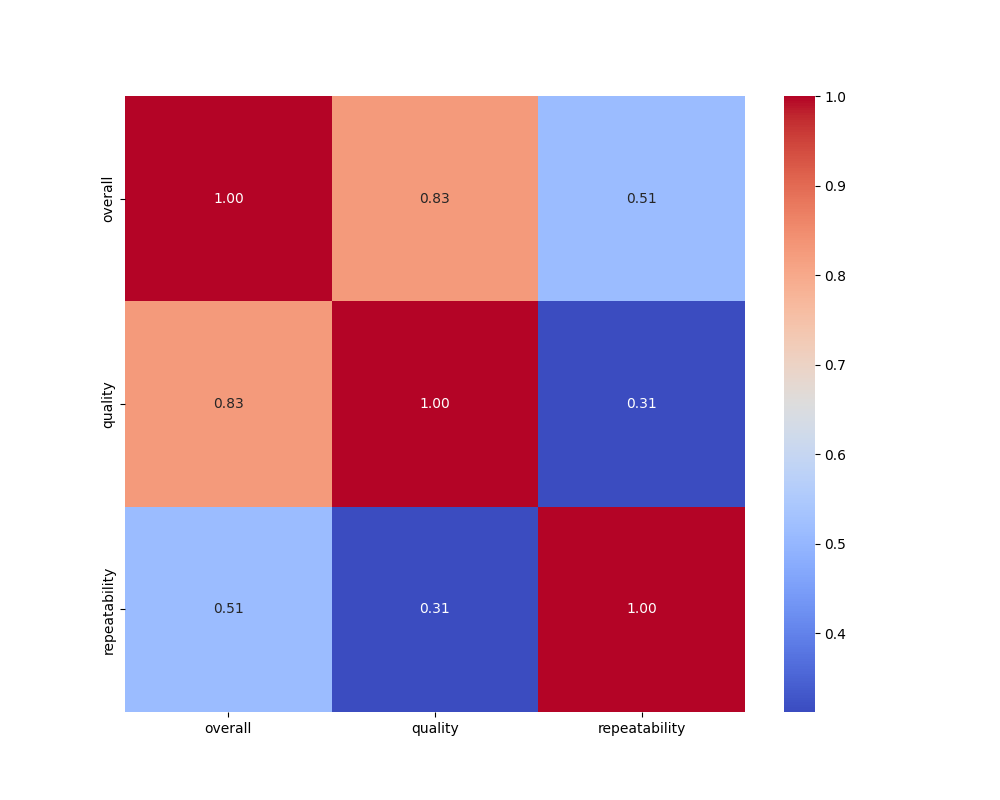

# Dataset Analysis Report

## Summary Statistics
|        | date      | language   | type   | title             | by                |    overall |     quality |   repeatability |
|:-------|:----------|:-----------|:-------|:------------------|:------------------|-----------:|------------:|----------------:|
| count  | 2553      | 2652       | 2652   | 2652              | 2390              | 2652       | 2652        |     2652        |
| unique | 2055      | 11         | 8      | 2312              | 1528              |  nan       |  nan        |      nan        |
| top    | 21-May-06 | English    | movie  | Kanda Naal Mudhal | Kiefer Sutherland |  nan       |  nan        |      nan        |
| freq   | 8         | 1306       | 2211   | 9                 | 48                |  nan       |  nan        |      nan        |
| mean   | nan       | nan        | nan    | nan               | nan               |    3.04751 |    3.20928  |        1.49472  |
| std    | nan       | nan        | nan    | nan               | nan               |    0.76218 |    0.796743 |        0.598289 |
| min    | nan       | nan        | nan    | nan               | nan               |    1       |    1        |        1        |
| 25%    | nan       | nan        | nan    | nan               | nan               |    3       |    3        |        1        |
| 50%    | nan       | nan        | nan    | nan               | nan               |    3       |    3        |        1        |
| 75%    | nan       | nan        | nan    | nan               | nan               |    3       |    4        |        2        |
| max    | nan       | nan        | nan    | nan               | nan               |    5       |    5        |        3        |

## Insights from LLM
### 1. Describe this dataset as a story (structure, purpose, and context).

The dataset contains a collection of reviews or ratings for various movies across multiple languages. It is structured in a tabular format with columns representing attributes such as `date`, `language`, `type`, `title`, `by`, `overall`, `quality`, and `repeatability`. 

- **Structure**: 
  - The `date` column specifies when the review was conducted, allowing for temporal analysis over time.
  - The `language` column indicates the language in which the movie was produced.
  - The `type` column specifies whether the entry is classified as a `movie`, `fiction`, or `non-fiction`.
  - The `title` and `by` columns provide information about the movie itself and the contributors (actors, directors, etc.).
  - The `overall`, `quality`, and `repeatability` columns provide a quantitative assessment of the movie, where higher numbers signify better ratings/quality/repeatability.

- **Purpose**: The primary purpose of this dataset is to analyze movie ratings over time and by language, possibly aiding film producers, marketers, and researchers in understanding audience preferences and trends. Understanding how different aspects correlate could help in enhancing future movie productions and marketing strategies.

- **Context**: The dataset reflects a diverse range of global cinema through languages and locations, making it versatile for cross-cultural analysis. The presence of features like `quality` and `repeatability` allows for deeper scrutiny into audience engagement and satisfaction.

### 2. Summarize the analysis performed

To extract valuable insights from this dataset, several analyses could be performed:

- **Descriptive Statistics**: To understand summary statistics like mean, median, and mode for numeric columns (overall ratings, quality, repeatability).
- **Correlation Analysis**: Examining the relationships between different numerical variables to see how quality might correlate with overall ratings or repeatability.
- **Visualization**: Implementing visual tools such as histograms, scatter plots, and box plots to delineate the distribution of ratings, trends over time, and potential clusters or outliers within the dataset.
- **Language Analysis**: Assessing how movies in different languages fare regarding overall ratings, quality, and repeatability.

### 3. Highlight the key insights discovered

By performing analysis on this dataset, some of the possible key insights could include:

- **Rating Distribution**: The overall ratings are consistently skewed towards the higher end of the scale (mostly 3 or 4), indicating general satisfaction among viewers regardless of the language.
- **Quality Margins**: Movies rated higher in quality (4 or above) often correspond to repeatability ratings of 2 or higher, suggesting that quality may indeed influence the desire to re-watch films.
- **Language Performance**: Certain languages (e.g., Telugu, Tamil) may have more high-rated films, pointing towards a strong local market and possibly cultural influences on preferences.
- **Temporal Trends**: Analyzing the `date` of the reviews could reveal trends over time in movie appreciation or changes in rating patterns, which could coincide with industry changes or audience tastes.

### 4. Discuss the implications of these findings and what actions can be taken based on them

The insights from this dataset can lead to meaningful actions:

- **Marketing Strategies**: Understanding which movies receive higher ratings can help guide marketing efforts, emphasizing successes in specific languages or themes.
- **Content Creation**: Filmmakers and producers can utilize this data to comprehend viewer preferences, focusing on aspects that correspond with higher quality and repeatability to enhance engagement.
- **Diversification of Content**: If one language or type of movie consistently outperforms others, there may be an opportunity to invest more in that area, expanding production to include similar genres or themes.
- **Audience Engagement**: High repeatability ratings indicate movies that resonate well with viewers, suggesting that outreach efforts—including sequels, spin-offs, or audience engagement campaigns—can be centered around these films to cultivate a loyal viewer base.
- **Continuous Monitoring**: Regular updates and analyses of movie ratings can assist stakeholders in staying aligned with audience preferences and evolving trends in cinematography.

These actions will facilitate better decision-making in the film industry, potentially resulting in higher viewer satisfaction and increased profitability.

## Visualizations
### correlation_heatmap.png

### scatterplot.png

